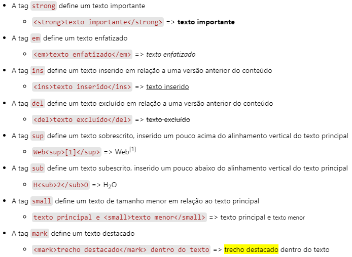
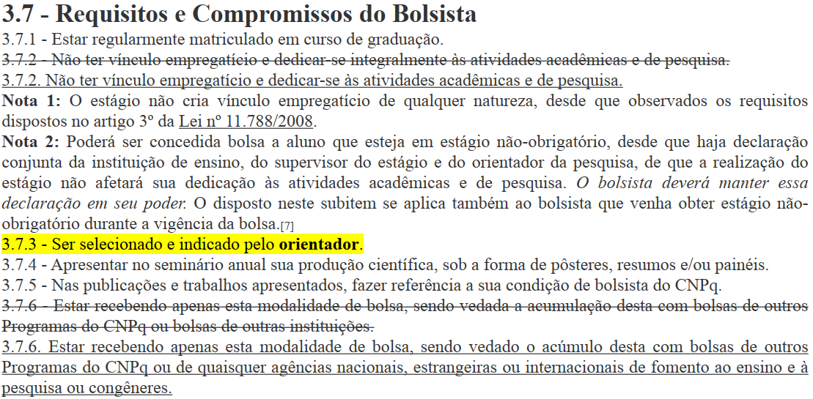
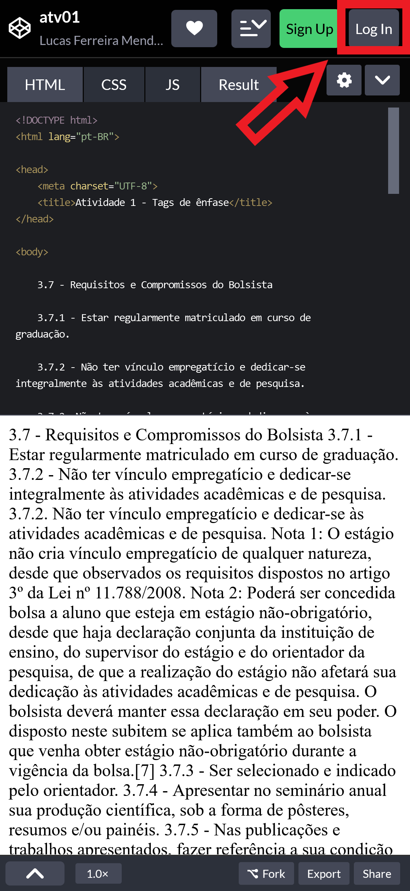
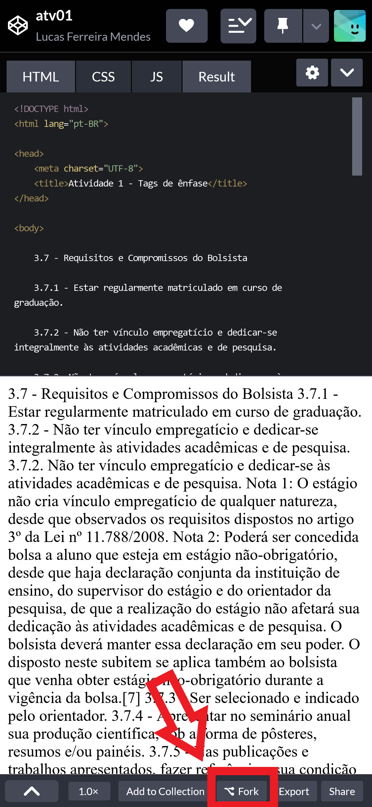
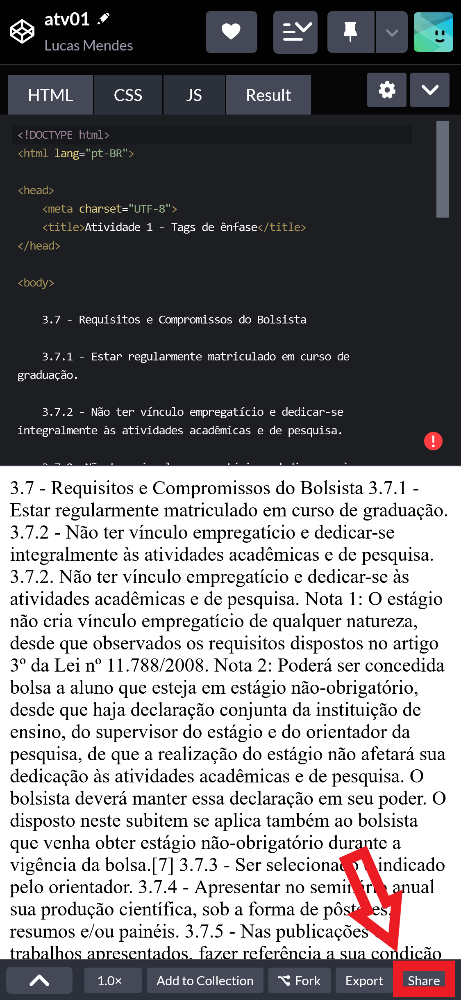

# Atividade Prática 01

> Em nossa primeira atividade prática vamos trabalhar um pouco as tags básicas para ênfase ou destaque textual.
> Segue abaixo uma breve [revisão](#def) sobre as tags que serão abordadas nesta atividade e, logo após, as [instruções](#inst) para sua realização.

## Tags de Destaque: definição e exemplos

> As tags de destaque são usadas para destacar termos ou trechos em um conteúdo textual.
> Elas são ***tags semânticas***, ou seja, dão um significado ao trecho marcado.

<!-- - A tag `strong` define um texto importante
    - `<strong>texto importante</strong>` => <strong>texto importante</strong>

- A tag `em` define um texto enfatizado
    - `<em>texto enfatizado</em>` => <em>texto enfatizado</em>

- A tag `ins` define um texto inserido em relação a uma versão anterior do conteúdo
    - `<ins>texto inserido</ins>` => <ins>texto inserido</ins>

- A tag `del` define um texto excluído em relação a uma versão anterior do conteúdo
    - `<del>texto excluído</del>` => <del>texto excluído</del>

- A tag `sup` define um texto sobrescrito, inserido um pouco acima do alinhamento vertical do texto principal
    - `Web[1]` => Web[1]

- A tag `sub` define um texto subescrito, inserido um pouco abaixo do alinhamento vertical do texto principal
    - `H2O` => H2O

- A tag `small` define um texto de tamanho menor em relação ao texto principal
    - `texto principal e <small>texto menor</small>` => texto principal e <small>texto menor</small>

- A tag `mark` define um texto destacado
    - `<mark>trecho destacado</mark> dentro do texto` => <mark>trecho destacado</mark> dentro do texto -->

    

## Instruções para Realização da Atividade

- Esta atividade tem o objetivo de exercitar o uso das tags semânticas de destaque e ênfase textual apresentadas acima e abordadas em aula;

- A atividade consiste em replicar o resultado apresentado na imagem abaixo, que traz um exemplo de texto de um edital de seleção de bolsista para projeto de pesquisa;

    

- Como você pode perceber, o texto contém diversos destaques, desde textos inseridos ou deletados até textos subescritos. Logo, você deve usar as tags de destaque adequadas para cada situação;

- O código base para esta atividade encontra-se nesta pasta, no arquivo [`index.html`](./index.html);

- Envie o arquivo HTML com a resposta pelo Classroom da turma, no post feito para esta atividade; ou

- Caso prefira, pode utilizar a ferramenta online CodePen, onde o código base desta atividade encontra-se neste [link](https://codepen.io/lucasifce/pen/ExMLLXN);

    > Ao acessar o link da atividade no CodPen, siga as seguintes etapas:
    >> - Faça login, caso ainda não tenha feito;
    >
    >  

    >    
    > 
 
    >
    >> - Realize um *fork* do projeto (isso irá copiá-lo para sua conta);
    >
    > 

    >    
    >
 
    >
    >> - Faça as alterações necessárias para concluir a atividade e então, copie o link de compartilhamento do seu projeto com a atividade concluída;
    >
    > 

    >    
    >

    >
    >

    >    
    >
 
    >
    > - Por fim, no classroom, entregue o link copiado como resposta da atividade.  
