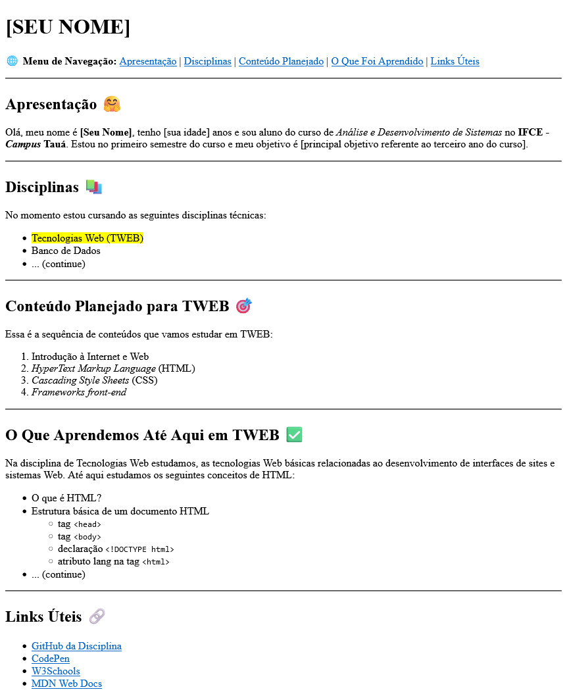
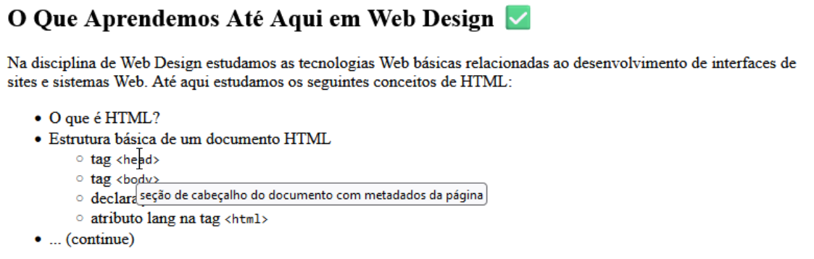

# Atividade Prática 02: Tags Básicas

> Nesta atividade vamos trabalhar de forma mais completa, algumas das tags básicas que aprendemos até aqui. Relembrando:
> - ***Tags de título***: `h1` a `h6`
> - ***Tags de ênfase e destaque***: `strong`, `em`, `ins`, `del`, `sup`, `sub`, `small`, `mark`
> - ***Tag de parágrafo***: `p`
> - ***Tag de link***: `a`
> - ***Tags básicas sem fechamento***: `br` e `hr`
> - ***Tags de formatação textual simples***: `b`, `i`, `u`, `s`
> - ***Tags de listas***: `ul`, `ol`, `dl`
> - ***Tópicos extras***: tag `code`, atributo `title`, símbolos especiais e emojis

[Acesse aqui](./../../../materiais/slides/IDW-02_HTML-INTRO.pdf) o material trabalhado em aula para revisar as tags acima.

## Instruções para Realização da Atividade

- Esta atividade tem o objetivo de exercitar o uso das tags básicas trabalhadas em aula.

- A atividade consiste em replicar o resultado apresentado na imagem abaixo, que traz um exemplo de página pessoal para organização dos estudos.

    

- O seu nome deve ser o primeiro conteúdo da página, sendo um título de nível 1.

- Os subtítulos seguintes devem ser definidos usando a tag de título de nível mais adequada.

- O menu de navegação é composto por links internos que levam a cada seção da página.

- Na seção "Disciplinas" complete a lista com todas as disciplinas que está cursando no semestre atual, deixando destacada a disciplina de Tecnologias Web.

- Na seção "O que aprendemos até aqui em TWEB" complete a lista com a maior quantidade possível de items listados com relação ao conteúdo estudado na disciplina.

- Além disso, defina para algums termos uma explicação extra que deve ser apresentada ao passar o mouse por cima do texto, como a seguir:

    

- Perceba que os termos que exemplificam tags HTML possuem o trecho da tag formatado em uma fonte monoespaçada, como em `<html></html>`.

- Utilize o site [Emojipedia](https://emojipedia.org/) para procurar o código dos Emojis e inserir na sua página HTML.
    
    - Sinta-se livre para usar outros emojis, porém é obrigatório usar os códigos hexadecimais (não somente copiar e colar).

- Na seção "Links Úteis" foram usados os seguintes links (fique à vontade para inserir outros links relacionados à disciplina):

    - https://github.com/lucas-lfm/tweb-ads-base

    - https://codepen.io/

    - https://www.w3schools.com/

    - https://developer.mozilla.org/pt-BR/

- Esta atividade não possui código base, você deve **começar do zero**. Use o [CodePen](https://codepen.io/), salvando a resposta em sua conta e enviando o link pelo Classroom, como feito na atividade passada ou use o VS Code (ou outro editor *offline*) e envie o arquivo HTML pelo Classroom.
