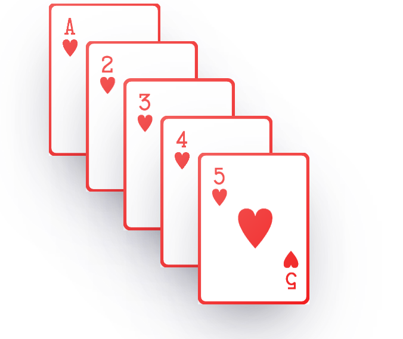

# Atividade Prática 05: Posicionamento e z-index

> Nesta atividade vamos trabalhar os conceitos de posicionamento e a propriedade z-index.

- [Acesse aqui](./../../materiais/slides/) os materiais trabalhados em aula.
- [Acesse aqui](https://www.w3schools.com/) o site W3School.
- [Acesse aqui](https://developer.mozilla.org/pt-BR/) o site MDN Web Docs.
- [Acesse aqui](https://codepen.io/collection/rxRBoW) a coleção de exemplos práticos trabalhados em aula e disponibilizados no CodePen.

## Instruções para Realização da Atividade

- Usando os conceitos e propriedades de Posicionamento CSS e z-index, replique o resultado abaixo:

    

        
    

- Você pode encontrar as imagens das cartas na pasta [img-instrucoes](./img-instrucoes/)

- Fique livre para usar outras imagens (outra temática)

- Use a propriedade `box-shadow` para replicar o efeito de sombra nas imagens, como apresentado acima

- 1 (um) ponto extra, caso consiga replicar o efeito de rotação apresentado no vídeo demonstrativo disponível [neste link](https://drive.google.com/file/d/1dXpD5CwIYgu0NuAeuBdfd3lRrYYBNbNt/view?usp=drive_link)