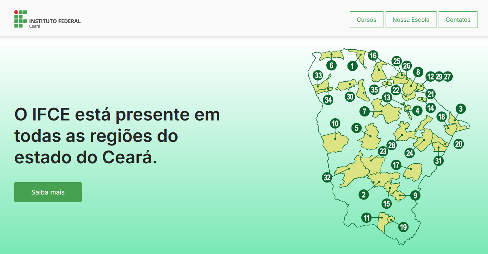

# Atividade Prática 06: Barra de navegação e seção inicial de página institucional

> Nesta atividade vamos trabalhar os conceitos de cores, backgrounds, box-model e posicionamento

- [Acesse aqui](./../../materiais/slides/) os materiais trabalhados em aula.
- [Acesse aqui](https://www.w3schools.com/) o site W3School.
- [Acesse aqui](https://developer.mozilla.org/pt-BR/) o site MDN Web Docs.
- [Acesse aqui](https://codepen.io/collection/rxRBoW) a coleção de exemplos práticos trabalhados em aula e disponibilizados no CodePen.

## Observações e Instruções para Realização da Atividade

- Usando os conceitos e de cores, backgrounds, box-model e posicionamento, replique o resultado abaixo:

    

        
    

- A prática consiste em construir os elementos iniciais de uma página institucional sobre o IFCE. Esse elementos constituem uma barra de navegação superior, com a logo do IFCE e menus de navegação, e uma seção inicial de CTA (call-to-action) com uma imagem, um texto de impacto e um elemento de CTA (botão "Saiba mais").

- Você pode encontrar as imagens a serem utilizadas na pasta [img-instrucoes](./img-instrucoes/).

- Replique o efeito de sombra na parte inferior da barra de nevegação, como apresentado na imagem acima.

- A seção inicial da página (CTA) tem como background um gradiente linear.

- Aplique um efeito consistente com o pseudo-seletor `:hover` nos menus e no botão de CTA, com o objetivo de destacar o elemento quando o usuário passar o mouse por cima, possibilitando fácil identificação do elemento selecionado e para deixar claro que aquele elemento é um alvo de ação.

- Defina uma largura máxima para os contêineres (área de navegação e seção inicial) de 1.024px.

- Utilize alguma ferramenta de seleção de cores para auxilixar na identificação das cores utilizadas. Por exemplo, a ferramenta [Adobe Color](https://color.adobe.com/pt/create/image).

- Trabalhe com as propriedades de posicionamento e box-model aprendidas em aula (position, margin, padding, float, etc) para definir as posições, espaçamentos e dimensões dos elementos da forma mais próxima ao resultado apresentado.
    - [Acesse aqui](https://classroom.google.com/c/NjY1NDExNTQ4MDA3/m/NzAyOTM3NDIyMDc1/details) o material sobre box-model e posicionamento trabalhado em aula (veja até o final, tem conteúdo extra que pode ser útil).
    - Quem já tem conhecimento ou já quer iniciar o estudo sobre flexbox, fique à vontade para utilizá-lo. Indico esse guia da Origamid (enquanto termino de preparar o material da disciplina 😉): https://origamid.com/projetos/flexbox-guia-completo/