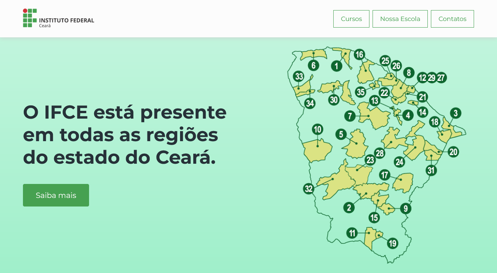
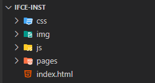

# Tecnologias Web - ADS 2024.1

## Roteiro da Prática 07

> **_Prática 07_** - *Barra de navegação e Seção Hero com Flexbox e Animação CSS*
>
> - **Objetivo:** construir a primeira parte de um site institucional para o IFCE, usando os conhecimentos aprendidos até aqui, além de novos conceitos e propriedades apresentados ao decorrer desta prática.
> - **Observações e Instruções Gerais:**
>   - Tente seguir o roteiro desta prática de forma a entender cada passo.
>   - Caso fique com alguma dúvida, fique à vontade para perguntar.
>   - Os arquivos necessários para a realização desta prática, estão na pasta [recursos](recursos) (imagens e textos utilizados).
>   - Vocês deverão utilizar o VS Code ou alguma plataforma online, como o [CodeSandBox](https://codesandbox.io) que possui uma interface similar ao VS Code e permite estruturar nosso projeto e fazer upload dos recursos necessários.

### 1. Apresentação da Prática

- Esta prática tem o objetivo de construir a primeira parte do projeto de um site institucional para o IFCE usando os conhecimentos aprendidos até aqui, além de novos conceitos e propriedades apresentados ao decorrer desta prática.

- Vamos construir a barra de navegação superior e a seção hero do site (seção de destaque). Veja mais sobre seção hero [neste link](https://www.portalinsights.com.br/perguntas-frequentes/o-que-e-section-hero).

- O resultado esperado ao final desta prática é o seguinte: 

  <div style="width: 100%; margin: 0 auto">
    
  </div>

- O que vamos aplicar nesta prática?

  - Estruturação de um projeto web para site institucional
  - Definição externa de CSS
  - Separação de estilos com base nos componentes do site
  - Aplicação de fontes externas a partir do Google Fonts
  - Flexbox para a estruturação e posicionamento dos elementos
  - Box Model CSS
  - Tipografia
  - Cores e backgrounds
  - Transições, transformações e animações
  - Elementos semânticos
  - Imagens

### 2. Criação e estruturação do projeto

1. Crie uma pasta para o projeto, pode dar o nome de `ifce-inst`

1. Dentro dessa pasta crie a seguinte estrutura:

    <div style="width: 100%; margin: 0 auto; text-align: center;">
      
    </div>

1. Entenda a estrutura criada:
    - **_css_** - pasta onde serão organizadas todas as folhas de estilo do site
    - **_img_** - pasta onde serão organizados todas as imagens e ícones utilizados no site
    - **_js_** - pasta para organizar os scripts do site (vamos ter um pequeno código em JS em outra prática)
    - **_pages_** - pasta para organizar os arquivos HTML das demais páginas do site (teremos pelo menos mais uma)
    - **_index.html_** - HTML raíz do site (página inicial)

1. Faça download das imagens necessárias para esta prática a partir da pasta [recursos](recursos) e coloque-as na pasta `img` do seu projeto.

### 3. HTML da página Home

1. No arquivo `index.html` criado anteriormente, crie a estrutura básica do documento, modifique o idioma para Portugês Brasil (pt-BR) e defina o título da página como `IFCE`

1. Dentro da seção `head` do documento, adicione a seguinte tag **meta** para dar uma descrição para a página: `<meta name="description" content="Cursos gratuitos e de qualidade é no IFCE">`

1. Ainda na seção `head`, vamos definir o ícone da nossa página (que aparecerá na aba do navegador ao lado do título) com a tag `link`, da seguinte maneira: `<link rel="shortcut icon" href="./img/logo-ifce-icone.png" type="image/x-icon">`

1. Ao final desses passos, o código do arquivo `index.html` deve estar da seguinte maneira:

    ```html
    <!DOCTYPE html>
    <html lang="pt-BR">
    <head>
        <meta charset="UTF-8">
        <meta name="viewport" content="width=device-width, initial-scale=1.0">
        <meta name="description" content="Cursos gratuitos e de qualidade no IFCE">
        
        <title>IFCE</title>

        <link rel="shortcut icon" href="./img/logo-ifce-icone.png" type="image/x-icon">
    </head>
    <body>
        
    </body>
    </html>
    ```

1. Agora, vamos definir a estrutura inicial da nossa página dentro da seção `body` do documento

    - Defina um elemento `header` (cabeçalho) e um elemento `main` diretamente dentro da tag `body`.
    - Dentro do elemento `header` defina um elemento `nav` com 4 (quatro) links de navegação (elementos `a`), como a seguir:

        ```html
        <!-- cabeçalho -->
        <header class="content-center">
            <nav class="top-nav container-limiter">
                <a href="./index.html" class="brand-link">
                    
                </a>
                <a href="#cursos">Cursos</a>
                <a href="#escola">Nossa Escola</a>
                <a href="#contatos">Contatos</a>
            </nav>
        </header>
        ```

        >  ❗As classes aplicadas aos elementos serão utilizadas na estilização com CSS (explico lá 😉)

    - Perceba que dentro do primeiro link, colocamos uma imagem com o logotipo do IFCE:
    
    - Os demais links estão referenciando as demais seções que existirão em nossa página (serão construídos nas próximas práticas).

    - Dentro do elemento main, vamos criar uma primeira `section` para ser nossa seção de destaque (seção hero) e vamos atribuir uma classe chamada `hero-section`.

    - Dentro da `section` criada anteriormente, vamos definir uma div para ser o container do conteúdo dessa seção.

    - Dentro da div criada anteriormente, defina a estrutura interna do conteúdo: uma imagem e uma outra div para organizar os textos com o botão de ação.
    
    - O código dentro do elemento `main` deve ficar da seguinte maneira:

      ```html
      <!-- conteúdo principal -->
      <main>
          <section class="hero-section content-center">
              <div class="container-limiter">
                  <div class="content-text">
                      <h1>O IFCE está presente em todas as regiões do estado do Ceará.</h1>
                      <a class="btn btn-primary" href="#escola">Saiba mais</a>
                  </div>
                  
                  
              </div>
          </section>
      </main>
      ```

      >  ❗As classes aplicadas aos elementos serão utilizadas na estilização com CSS (explico lá 😉)

    - Explicando melhor:

        - Dentro da seção hero, temos uma `div` container para todo o conteúdo interno (no CSS vamos estilizar ela de forma a criar uma largura máxima para o conteúdo).
        - Na imagem, usamos o atributo `loading` com o valor `lazy` para dizer que o navegador só precisa carregar a imagem, que estiver fora da tela, quando o usuário rolar a página até perto dela. Veja mais [aqui](https://desenvolvimentoparaweb.com/html/lazy-loading-nativo-imagem-iframe/).
        - Logo abaixo, definimos uma div com a classe `content-text` para agrupar os elementos textuais e o botão que devem aparecer ao lado da imagem. Essa classe será usada mais adiante para estilizar esse elemento.
        - Dentro da div `content-text` definimos o título e o link que será estilizados como botão primário (por isso as classes `btn` e `btn-primary` aplicada a ele).


### 4. CSS Global

> Vamos definir as regras CSS globais do nosso site (estilizações globais, aplicadas a todas as páginas).

1. Crie um arquivo css chamado `style.css` dentro da pasta `css` do projeto.

1. Para não esquecer, vá ao arquivo `index.html` e referencie o arquivo css através da tag `link` dentro da seção `head`, adicionando a seguinte linha: `<link rel="stylesheet" href="./css/style.css">`

1. Voltando para o arquivo `style.css` adicione a importação da fonte `Montserrat` a partir do Google Fonts, com a seguinte linha de código: `@import url('https://fonts.googleapis.com/css2?family=Montserrat:ital,wght@0,100..900;1,100..900&display=swap');`
    - Essa deve ser a primeira linha de código do arquivo `style.css`

1. Agora, vamos definir variáveis globais para organizar melhor nosso código e nos possibilitar maior consistência em relação aos valores utilizados (cores e espaçamentos, por exemplo). Para isso, vamos selecionar a pseudo-classe `:root`, adicionando as seguindes propriedades:

    ```css
    :root {
      --primary-color: #46A151;
      --back-light-color: #fcfcfc;
      --text-color: #263138;
      --line-height: 1.5;
      --max-width-container: 1200px;
    }
    ```
    - O código acima cria diversas variáveis com valores predefinidos que poderemos utilizar sempre que necessário. Você pode dar qualquer nome às variáveis criadas, mas precisamos seguir esse padrão (iniciando com `--` e dando um nome que represente bem o que é aquele valor). 
    - Por exemplo, criamos a variável `--primary-color` para definir a cor primária da nossa aplicação (a cor utilizada para chamar a atenção do usuário e para expressar a marca da organização). 
    - Sempre que quisermos definir a cor de um determinado elemento com a cor primária, vamos referenciar essa variável e não o valor diretamente. Isso é útil, pois se ressolvermos mudar a cor primária, não precisaremos alterar o código de todos os elementos que tem a definição dessa cor. Saiba mais sobre variáveis globais [neste link](https://www.alura.com.br/artigos/construa-css-magico-variaveis-nativas).

1. Vamos definir o modo de dimensionamento dos elementos para considerar *padding* e borda com a propriedade `box-sizing`, em todos os elementos (com o seletor universal `*`), da seguinte maneira: 

    ```css
    * {
      box-sizing: border-box;
    }
    ```

1. Agora vamos retirar qualquer espaçamento que o navegador possa aplicar por padrão ao corpo da página, definir a fonte e cor padrão para o texto de todo o corpo da página e também definir que todos os elementos filhos direto do elemento `body` sempre ocuparão toda a largura da página. Veja como deve ficar:

    ```css
    body {
      font-family: "Montserrat", sans-serif;
      margin: 0;
      padding: 0;
      color: var(--text-color); /* veja que aqui usamos uma variável definida anteriormente */
    }

    /* o símbolo de maior que (>) indica que estamos selecionando os filhos diretos de body */
    body > * { 
      width: 100%;
    }
    ```

    - Perceba que para definir a cor do texto, usamos a função `var()` para referenciar uma variável criada anteriormente.

1. Agora vamos estilizar de forma geral o cabeçalho (`header`) e o elemento `main`:

    - Para o `header` vamos configurar a cor de plano de fundo usando o valor definido na variável `--back-light-color`, definir um posicionamento fixo no topo, uma altura de `6rem` (6 vezes o tamanho padrão da fonte), um padding de 2rem e uma sombra na parte inferior.

    - Para o elemento `main` só precisamos definir uma margem superior de `6rem`. Isso é necessário, pois com o `header` fixo, o elemento main ocuparia também o espaço do elemento `header`. Então damos um `margin-top` para levá-lo de volta ao posicionamento desejado (logo abaixo do `header`).

    - O código para essas definições deve ficar assim:

      ```css
      header {
        background-color: var(--back-light-color);
        position: fixed;
        top: 0;
        height: 6rem;
        padding: 2rem;
        box-shadow: 0px 3px 10px #ccccccaa;
      }

      main {
        margin-top: 6rem;
      }
      ```

1. Precisamos agora garantir que as seções de conteúdo da nossa página tenham uma largura máxima definida e sempre apareçam alinhadas ao centro da página. Isso é importante, pois em caso de telas maiores, se não houver limitação da largura máxima dos contêineres e alinhamento ao centro, o conteúdo seria "esticado" para as bordas ou seria apresentado alinhado ao lado esquerdo da página, deixando uma grande área em branco à direita.

    - Para isso vamos definir duas classes (já foram aplicadas aos elementos HTML): 
      - `.container-limiter`: para limitar a largura dos conteinêres de conteúdo
      - `.content-center`: para centralizar os contêineres na página
    
    - As regras CSS serão as seguintes: 
      ```css
      .container-limiter {
        /* define uma largura máxima - valor definido anteriormente em uma variável */
        max-width: var(--max-width-container);
        width: 100%; /** largura padrão de 100% até o limite definido acima */
        padding: 0 20px; /** padding nas laterais para o conteúdo não ficar colado na borda */
      }

      /** centralizando os contâineres horizontalmente usando flexbox */
      .content-center {
        display: flex;
        justify-content: center;
      }
      ```

1. Defina o tamanho da fonte do título `h1` para `2rem` e zere a margem superior, como a seguir:

    ```css
    h1 {
      font-size: 2rem;
      margin-top: 0;
    }
    ```

1. Agora vamos estilizar o link da seção hero para dar uma aparência de botão e torná-lo mais chamativo.

    - Defina os estilos gerais para os botões através da classe `btn`, já adicionada nos elementos corretos no html, da seguinte forma: 

      ```css
      .btn {
        border-radius: 4px;
        padding: 1rem 2rem;
        text-decoration: none;
        display: inline-block;
        /** tempo de transição para quando o elemento sofrer qualquer alteração em qualquer propriedade 
        * - isso torna a transição mais suave
        */
        transition: all 0.3s;
        /** ao definir uma borda transparente, estamos "reservando" o espaço para tornar a borda visível depois e não gerar inconsistência nos espaçamentos */
        border: 1px solid transparent;
      }
      ```

    - Agora, para definir um botão como primário (botão para chamar a atenção para uma ação) vamos definir regras CSS para a classe `btn-primary` (já aplicada no HTML).
    
    - Para o botão primário, defina a cor de background para a cor primária e a cor do texto para uma tonalidade próxima ao branco. Além disso, aumente o tamanho da fonte para `1.2rem`.

      ```css
      .btn-primary {
        background-color: var(--primary-color);
        color: #fcfcfc;
        font-size: 1.2rem;
      }
      ```

    - Para finalizar os estilos gerais, adicione um efeito no botão primário, que deve ocorrer quando o usuário passar o mouse por cima dele. A cor de background deve ser alterada para a cor que antes era do texto e vice-versa. Além disso, vamos definir uma borda com a cor primária.

      ```css
      .btn-primary:hover {
        background-color: #fcfcfc;
        color: var(--primary-color);
        border: 1px solid var(--primary-color);
      }
      ```

### 5. CSS para a barra de navegação

> Agora vamos definir as regras CSS aplicadas à barra de navegação do site.

1. Crie um outro arquivo na pasta `css` com o nome de `navbar.css`.
    - É uma boa prática separar nossas regras de estilo por cada componente principal do nosso site.

1. Novamente, volte ao arquivo `index.html` e referencie, na seção `head`, o arquivo css criado no passo anterior: `<link rel="stylesheet" href="./css/navbar.css">`

1. Vamos definir uma classe chamada `top-nav` para estilizar o elemento de navegação e uma classe chamada `brand-link` para estilizar o link que definimos com a imagem do logotipo do IFCE. As classes já foram aplicadas no HTML (observe em quais elementos)

1. Para posicionar e alinhar os itens de menu da barra de navegação, vamos utilizar flexbox definindo o `display` como `flex`, definindo alinhamento horizontal como `flex-end` (para os itens serem posicionados à direta), definindo um `gap` (espaço entre itens) de `0.5rem` e alinhando verticalmente os itens ao centro com a propriedade `align-items`. Por fim, definimos uma altura de 100% para a barra de navegação. O código deve ficar assim:

    ```css
    .top-nav {
      display: flex;
      justify-content: flex-end;
      gap: 0.5rem;
      align-items: center;
      height: 100%;
    }
    ```

1. Só temos um problema agora: todos os items de menu (links) foram alinhados à direita, mas o logotipo do IFCE deve ficar alinhado à esquerda. Para resolver isso, selecionamos o link com a classe `brand-link` e definimos uma `margin-right` como `auto`. Assim o navegador vai calular a margem necessária à direita desse elemento e posicioná-lo à esquerda. Veja como fica:

    ```css
    .brand-link {
      margin-right: auto;
    }
    ```

1. Vamos definir a altura para a imagem do logo do IFCE com o valor `48px`:

    ```css
    .brand-link img {
      height: 48px;
    }
    ```

1. Agora vamos estilizar os textos dos links da barra de navegação da seguinte forma:

    ```css
    .top-nav a:not(.brand-link) {
      color: var(--primary-color);
      border: 1px solid var(--primary-color);
      text-decoration: none;
      padding: 0.75rem 1.15rem;
      /** define a duração de transição */
      transition: all 0.3s;
    }
    ```

1. Por fim, vamos adicionar um efeito para ocorrer quando o usuário passar o mouse sobre os links. O efeito será o de alternar as cores do plano de fundo e do texto:

    ```css
    .top-nav a:hover:not(.brand-link) {
      background-color: var(--primary-color);
      color: var(--back-light-color);
    }
    ```

    - Que seletor estranho, professor!!! 🤔
    - Vamos lá, deixe-me explicar... 👇
      - Primeiro nós selecionamos os elementos `a` que estão dentro do elemento de classe `.top-nav`. Até aqui, nada de novidade!
      - A porção final é novidade: `:not(.brand-link)`
      - A pseudo-classe `:not()` é uma ***notação funcional*** de ***negação***. Ela é usada para selecionar um elemento que **não é representado** pelo seu argumento (o que vai dentro dos parênteses).
      - Nesse exemplo, `a:hover:not(.brand-link)`, estamos selecionando elementos `a`, com estado `:hover`, que ***não contenham*** a classe `brand-link`. Ou seja, qualquer um dos links da barra de navegação, ***EXCETO o link que tem a classe .brand-link: o link com o logo do IFCE***

### 6. CSS para a página HOME 

> Por fim, vamos definir os demais estilos aplicados aos elementos da página inicial. No momento, temos somente a seção hero com uma imagem e um componente textual com um CTA.

1. Primeiro, crie outro arquivo na pasta `css` com o nome `home.css`.

1. Vá ao arquivo `index.html` e referencie o arquivo cirado acima.
    
    - Não vou mostrar mais como fazer. Cansei... e vocês já sabem 🤣

1. Inicialmente, vamos definir um gradiente bem legal para o background da seção hero.

    - Para isso, utilizamos a propriedade `background-image`. Também já vamos definir um tamanho de `400%` para a largura e para a altura do background (depois vocês vão entender o porquê). Ficará dessa forma o código inicial com as regras aplicadas à seção hero:

      ```css
      .hero-section {
        background-size: 400% 400%;
        background-image: linear-gradient(transparent, rgb(123, 233, 182));
      }
      ```

      - O gradiente linear foi definido de cima para baixo, transicionando entre transparente e uma tonalidade da cor verde (`rgb(123, 233, 182)`). 

1. Agora vamos trabalhar no contêiner interno da seção hero, que aplicamos a classe `container-limiter`. Nele, vamos usar o flexbox para deixar lado a lado a imagem e a parte textual com o botão de ação, definindo o alinhamento deles (com `justify-content`), um `gap` mínimo de `2rem`, alinhando verticalmente ao centro com `align-items` e permitindo a quebra dos items para uma nova linha se necessário (com `flex-wrap`). Veja como deve ficar:

    ```css
    .hero-section .container-limiter {
      display: flex;
      justify-content: space-between;
      align-items: center;
      flex-wrap: wrap;
      gap: 2rem;
    }
    ```

1. Defina a largura da imagem para `500px` e defina a largura da div com a classe `content-text` (contêiner de todo o conteúdo textual e botões) para `50%` da largura da seção. Além disso, vamos definir uma margem inferior para os botões. Veja como o código deve ficar:

    ```css
    .hero-section img {
      width: 500px;
    }

    .hero-section .content-text {
      width: 50%;
    }

    .hero-section .btn {
      margin-bottom: 0.5rem;
    }
    ```

### 7. Animação aplicada à seção Hero

> Galera, chegou a parte mais ***TOP*** da prática 😎! Vamos trabalhar com animações em CSS ✨. Na nossa prática a animação vai consistir em fazer o gradiente que nós aplicamos no backgorund da seção hero ficar mudando de posição infinitamente.

1. Antes de mais nada, é importante conceituar o assunto `animações CSS`. O CSS permite definir animações automáticas para elementos da página, fazendo com que os elementos mudem seu estado de estático para dinâmico, de forma automática e abrindo diversas possibilidades de efeitos visuais incríveis.

    - Usamos a propriedade `animation` para defnir as características da animação: duração, estilo, repetições, comportamento, entre outras.
    - Usamos `@keyframes` para definir a sequência da animação e como o elemento dever ser apresentado em um dado momento. Dessa forma, podemos definir pontos de transição.

1. Para o nosso exemplo, vamos definir um `@keyframes` com os seguintes pontos de transição, dentro da duração da animação: `0%`, `25%`, `50%`, `75%` e `100%`. Em cada um desses pontos de parada, vamos alterar a posição do background, fazendo com que os gradientes definidos anteriormente fiquem mudando de lugar. O código ficará como mostrado a seguir e deverá ser colocado ao final do arquivo `home.css`.

    ```css
    @keyframes hero-gradient {
      0% {
        background-position: 0% 25%;
      }

      25% {
        background-position: 50% 50%;
      }

      50% {
        background-position: 100% 75%;
      }

      75% {
        background-position: 50% 50%;
      }

      100% {
        background-position: 0% 25%;
      }
    }
    ```

    - Perceba que demos um nome para esse **keyframe**. Chamamos nossa animação de `hero-gradient`.

1. Agora precisamos voltar lá no início do arquivo `home.css`, no seletor da seção hero e usar a propriedade `animation` para definir qual animação queremos e quais as características dela. O código deve ficar assim:

    ```css
    .hero-section {
      background-size: 400% 400%;
      background-image: linear-gradient(transparent, rgb(123, 233, 182));
      animation: 4s linear infinite alternate hero-gradient;
    }
    ```

    - Perceba que adicionamos somente a propriedade `animation`, definindo:
      - duração da animação: `4 segundos`
      - a forma como a animação progride com o tempo: `linear` (transições lineares, sem "pulos")
      - a quantidade de repetições: `inifinite`
      - a direção da animação: `alternate` (quando chega ao final da animação, faz o processo reverso)
      - o nome da animação: `hero-gradient` (o `@keyframes` que definimos anteriormente)

- Se aprofunde mais sobre animações com os conteúdos abaixo:

  - [Usando animações CSS (MDN Web Docs)](https://developer.mozilla.org/pt-BR/docs/Web/CSS/CSS_animations/Using_CSS_animations)
  - [CSS: animações com Transition e Animation (Alura)](https://www.alura.com.br/artigos/css-animacoes-com-transitions-animations?srsltid=AfmBOoqOYIWkdjAkkyrLNkaSuFbyGd2I5pa_XB3cSWnOFxXJW3spkHvX)
  - [Minicurso Animações CSS (Canal DPW)](https://youtu.be/eTELLTacg-8?feature=shared)